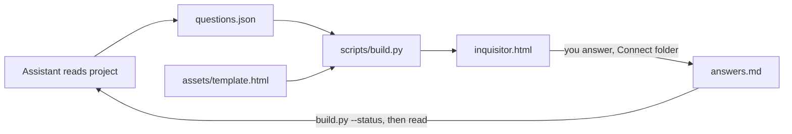

<p align="center"></p>

# inquisitor

An agent skill that grills you about a project, then keeps your answers. It reads the repo, writes a question spec, and builds one self-contained HTML page that autosaves every answer to `answers.md` so the assistant can read it back as the spec. (SKILL.md, scripts/build.py)

## The Rundown

You have a project with thirty open decisions and no patience for a chat that asks them one at a time. Inquisitor turns "what is still undecided?" into a questionnaire you answer at your own pace.

- **What it does:** the assistant reads your READMEs and notes, finds where your goal fights your own rules, and writes `questions.json`. `scripts/build.py` validates it and renders `inquisitor.html` from `assets/template.html`. (SKILL.md, scripts/build.py:98)
- **What you get on the page:** options with consequences, a recommended pick with the reason, free text, notes, Defer, per-section bulk accept, blocker/important/later tags, filters and a progress bar. (assets/template.html)
- **How answers survive:** open the page in Chrome or Edge, click **Connect folder** once, pick the `inquisitor` folder. Each answer rewrites `answers.md` within about 500 ms and is restored on reopen. Other browsers keep answers in the browser and download the file on Finish. (assets/template.html: `flush`, `attach`)
- **How the assistant reads it back:** `answers.md` is plain Markdown. Answers are binding, "accepted in bulk" is a default to confirm, deferred and unanswered are open. (SKILL.md, step 6)
- **Footprint:** Python 3.8+ standard library only. The page makes no network calls. No manifests, containers or CI exist in this repo.
- **Maturity:** small and stable. Six unit tests, no license file yet.
- **Start here:** `SKILL.md` for the procedure, `examples/questions.example.json` for a spec you can copy.

## Last Updated

- Last Updated: 2026-10-01
- Last Commit Date: 2026-10-01 (git evidence, before this README commit)

## Table of Contents

- [The Rundown](#the-rundown)
- [Last Updated](#last-updated)
- [Repository Overview](#repository-overview)
- [Components](#components)
- [Architecture Overview](#architecture-overview)
- [Tech Stack and Dependencies](#tech-stack-and-dependencies)
- [Project Layout](#project-layout)
- [Getting Started (Local Development)](#getting-started-local-development)
- [Configuration](#configuration)
- [Running the System](#running-the-system)
- [Deployment and CI/CD](#deployment-and-cicd)
- [Deep Code Reference](#deep-code-reference)
- [Data and Integrations](#data-and-integrations)
- [Security Notes](#security-notes)
- [Observability and Monitoring](#observability-and-monitoring)
- [Common Tasks and Troubleshooting](#common-tasks-and-troubleshooting)
- [Change Log](#change-log)
- [Contributing and Coding Standards](#contributing-and-coding-standards)
- [License](#license)

## Repository Overview

One skill, one repo. The skill folder is the repo root; `install.py` copies it into each assistant's skills directory. Output files are written relative to the current working directory of whoever runs the skill, never into this repo.

```
./inquisitor/inquisitor.html   the questionnaire (self-contained, opens from disk)
./inquisitor/questions.json    the spec it was built from (rebuildable)
./inquisitor/answers.md        written by the page as you answer
```

## Components

| Component | Type | Language/Framework | Runtime/Target | Path | Purpose |
| --- | --- | --- | --- | --- | --- |
| Skill definition | Agent skill | Markdown | Claude Code, Codex, Cline, Copilot CLI | `SKILL.md` | Procedure, spec format, rules for reading answers back |
| Builder | CLI script | Python (stdlib) | Python 3.8+ | `scripts/build.py` | Validate a spec, render the page, report status from `answers.md` |
| Page template | HTML/CSS/JS | Vanilla JS | Browser (Chrome/Edge for file writes) | `assets/template.html` | The questionnaire UI and the autosave logic |
| Installer | CLI script | Python (stdlib) | Python 3.8+ | `install.py` | Install or remove the skill for four assistants |
| Tests | Test suite | `unittest` | Python 3.8+ | `tests/test_build.py` | Spec validation, build, status, Markdown round trip |
| Example | Sample spec | JSON | n/a | `examples/questions.example.json` | A small valid spec |

## Architecture Overview



The template embeds the spec as JSON in a `<script type="application/json">` block, with `</` and `<!--` escaped. (scripts/build.py:106-107) The page writes `answers.md` through the File System Access API and stores a machine-readable state comment at the end so it can resume. (assets/template.html: `buildMd`, `parseState`)

## Tech Stack and Dependencies

| Area | Choice |
| --- | --- |
| Language | Python 3.8+, plus vanilla browser JavaScript |
| Dependencies | None. No lockfile or manifest exists, so there is no evidence of any third-party package |
| Browser APIs | File System Access (`showDirectoryPicker`), IndexedDB (remembers the folder handle), `localStorage` (backup copy) |

## Project Layout

```
  - SKILL.md                         skill procedure and spec format
  - README.md                        this file
  - logo.png                         README logo
  - install.py                       installer
  - scripts/
    - build.py                       validate, build, status
  - assets/
    - template.html                  questionnaire template
  - examples/
    - questions.example.json         sample spec
  - tests/
    - test_build.py                  unit tests
  - .gitattributes                   * text=auto eol=lf
  - .gitignore                       __pycache__, *.pyc, .DS_Store
```

## Getting Started (Local Development)

```
git clone <this repo>
cd inquisitor
python install.py --dry-run
python install.py
```

Needs Python 3.8 or newer. Nothing to `pip install`.

## Configuration

There are no config files for the skill itself. The installer reads two optional environment variables:

| Variable | Effect |
| --- | --- |
| `CLAUDE_CONFIG_DIR` | Overrides `~/.claude` as the Claude install location |
| `COPILOT_HOME` | Overrides `~/.copilot` as the Copilot install location |

Per-spec options live in `questions.json`: `title`, `subtitle`, `context`, `sections`, `questions`, and optional `answersFile` and `readerNote`. Full format in `SKILL.md`.

## Running the System

```
python scripts/build.py inquisitor/questions.json     build the page (validates first)
python scripts/build.py --validate spec.json          validate only
python scripts/build.py --status                      counts and open blockers from answers.md
python scripts/build.py spec.json --out some/dir      write somewhere other than ./inquisitor
```

Then open `inquisitor/inquisitor.html` in Chrome or Edge, click **Connect folder**, choose the `inquisitor` folder, and answer. **Finish** marks `answers.md` as FINAL; you can reopen and keep editing.

Install targets (user scope):

| Assistant | Location |
| --- | --- |
| Claude Code | `~/.claude/skills/inquisitor` |
| Codex | `~/.agents/skills/inquisitor` |
| Cline | `~/.cline/skills/inquisitor` |
| Copilot CLI | `~/.copilot/skills/inquisitor` |

Other flags: `--target claude|codex|cline|copilot`, `--scope project --project PATH`, `--uninstall`, `--dry-run`. (install.py)

## Deployment and CI/CD

Insufficient Evidence of CI/CD. Searched for `.github/workflows`, pipeline files, containers and IaC; none exist. Deployment is `python install.py`. Verification is the local suite below.

## Deep Code Reference

### Cross-Reference Index

| Symbol | Where | What it does |
| --- | --- | --- |
| `validate(spec)` | scripts/build.py:36 | Returns a list of spec errors |
| `build(spec_path, out)` | scripts/build.py:98 | Renders `inquisitor.html`, saves `questions.json` |
| `status(out)` | scripts/build.py:122 | Summarises `answers.md`, lists open blockers |
| `main(argv)` | scripts/build.py:136 | Argument parsing and dispatch |
| `buildMd`, `parseState` | assets/template.html | Write and resume `answers.md` |
| `flush`, `attach`, `connect`, `reconnect` | assets/template.html | Folder handle and autosave |
| `renderCard`, `renderAll`, `bulkAccept`, `finish` | assets/template.html | UI |

### Spec validation rules

Unique ids matching `[A-Za-z0-9._-]`; every question names an existing section; priority is `blocker`, `important` or `later`; zero options (then `freeText` is required) or at least two; at most one recommended option unless `multi`; a recommended option needs a `recommendation`. (SKILL.md, scripts/build.py:36)

## Data and Integrations

No database, no network, no external services. State lives in three places: `answers.md` (authoritative), the browser's `localStorage` (backup), and IndexedDB (the remembered folder handle).

## Security Notes

- The page never contacts a network and calls no model.
- The spec is embedded with `</` and `<!--` escaped so question text cannot close the script block; other markup in text fields is HTML-escaped by the page. (scripts/build.py:106-107, assets/template.html: `esc`)
- Rebuilding overwrites `inquisitor.html` and `questions.json` but never touches `answers.md`. (SKILL.md)
- Do not put secrets in answers or notes; `answers.md` is plain text on disk.
- No security scan was run for this README. Insufficient Evidence beyond the static reading above.

## Observability and Monitoring

None. The save pill in the page header shows the last write time or a failure; write errors also go to the browser console.

## Common Tasks and Troubleshooting

| Problem | Fix |
| --- | --- |
| Header says "Not connected" | Click **Connect folder** and pick the `inquisitor` folder |
| "Click to reconnect" after reopening | Click the pill and grant access again; browsers drop the permission between visits |
| Firefox or Safari | No folder write. Answers stay in the browser; **Finish** downloads `answers.md` |
| `spec invalid:` from build | Fix each listed error and rebuild |
| Adding follow-up questions | Edit `questions.json`, keep existing ids, rebuild. Answers are keyed by id and survive |
| Run the tests | `python -m unittest discover -s tests` |

## Change Log

Versions and dates are not tagged in this repo; entries follow commit order.

### Added

- Initial skill: spec validator, builder, page template, installer, example, tests.
- README with logo.

### Changed

- Template aligned with the original substrate-grill page: missing styles, plain free-text recommendation, "How this works" heading, restore-from-browser status.

## Contributing and Coding Standards

- Python 3.8+, standard library only. Keep it that way.
- `.gitattributes` forces `eol=lf`; do not commit CRLF.
- Question ids are permanent. Never reuse an id for a different question.
- After changing the skill, run `python install.py` so installed copies do not drift.
- Run `python -m unittest discover -s tests` before committing.

## License

Insufficient Evidence. No LICENSE file was found in the repository.
