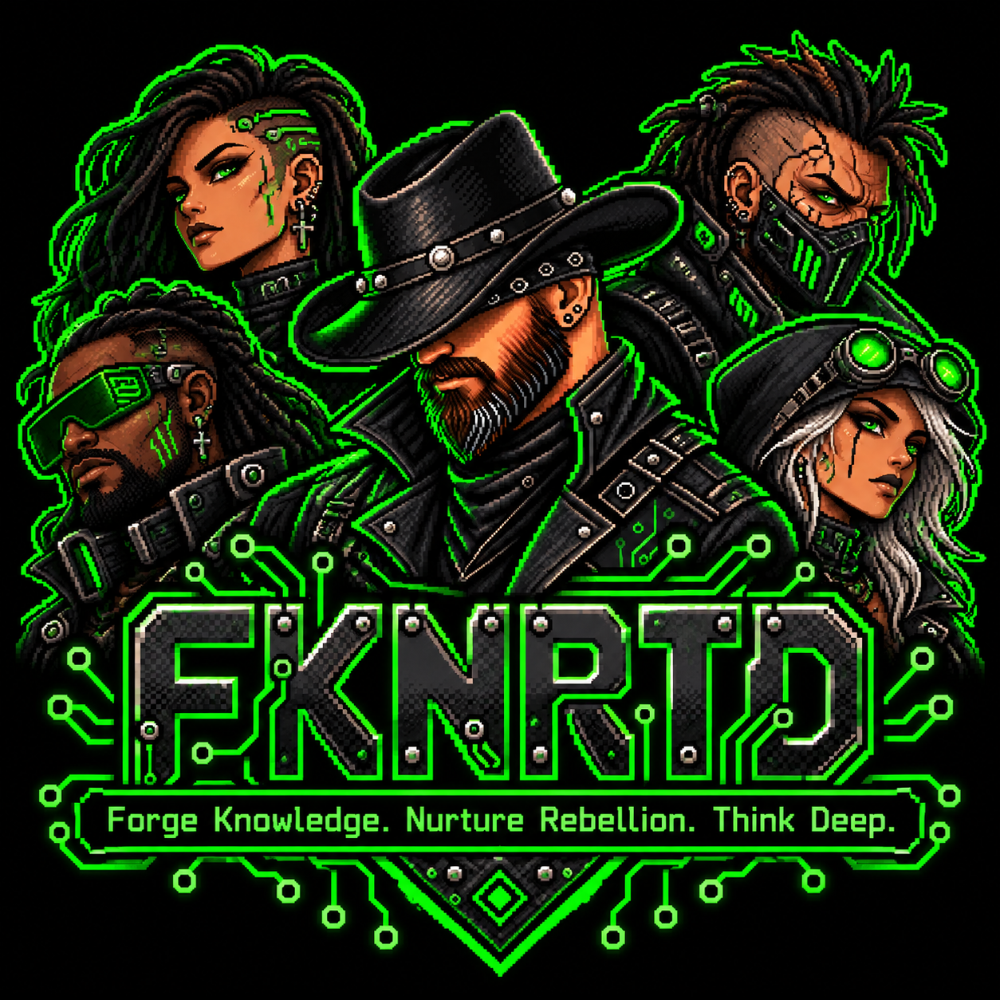
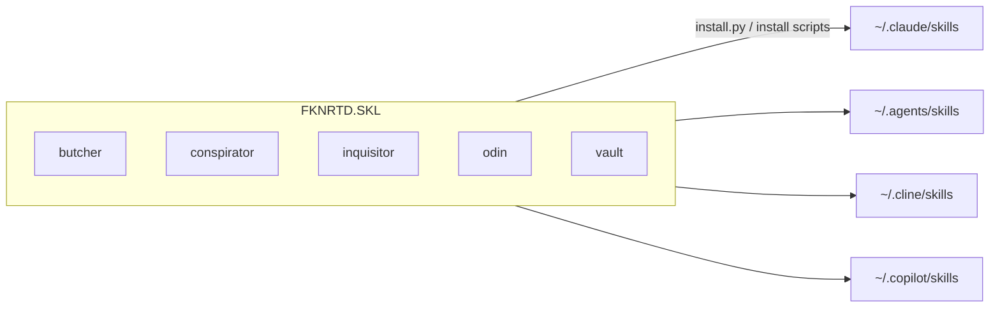

<div align="center">


# FKNRTD.SKL

**The agent skills nullcromancer ships.**

`five skills` · `one repo` · `four assistants` · `no drift`
</div>

> **Heads up:** Each skill is independent. Pick the folder you need and start with its `SKILL.md`.

## The Rundown

Each folder is a self-contained skill: a `SKILL.md` that tells an assistant what to do, plus whatever scripts, templates and tests it needs. Most install with their own `python install.py`, which resolves its source from its own location and copies it to every assistant's skills folder.

| Skill | One-liner |
| --- | --- |
| `butcher` | Always-on token-efficiency rules: cut repetition, narration and oversized output, never correctness. |
| `conspirator` | Multi-agent pairing: Claude audits, Codex/Cline/Copilot implement in isolated worktrees, talking in compact packets. |
| `inquisitor` | Grills you with a questionnaire page that autosaves answers to `answers.md`, then reads them back as the spec. |
| `odin` | Read-only repository forensics and documentation: evidence packet, README, docs site, developer handoff. |
| `vault` (null-vault) | Photo-to-inventory cataloging engine backed by SQLite: identify, research, value, export. |

The skills are independent. There is no shared library, no top-level build and no CI in this repo. Start with the skill you want and read its `SKILL.md`.

(`SKILL.md` in each folder)

## Last Updated

- **Last Updated:** 2026-10-01
- **Last Commit Date:** 2026-10-01T21:02:02-04:00, commit `1404ba1` on `main` (from a read-only `git log`)

## Table of Contents

- [Last Updated](#last-updated)
- [The Rundown](#the-rundown)
- [Repository Overview](#repository-overview)
- [Components](#components)
- [Architecture Overview](#architecture-overview)
- [Tech Stack and Dependencies](#tech-stack-and-dependencies)
- [Project Layout](#project-layout)
- [Getting Started (Local Development)](#getting-started-local-development)
- [Configuration](#configuration)
- [Running the System](#running-the-system)
- [Deployment and CI/CD](#deployment-and-cicd)
- [Deep Code Reference](#deep-code-reference)
- [Data and Integrations](#data-and-integrations)
- [Security Notes](#security-notes)
- [Observability and Monitoring](#observability-and-monitoring)
- [Common Tasks and Troubleshooting](#common-tasks-and-troubleshooting)
- [Change Log](#change-log)
- [Contributing](#contributing)
- [License](#license)

## Repository Overview

A multi-component repo: 5 skill folders, about 400 files. The repo root holds only `.gitattributes` (`* text=auto eol=lf`), `.gitignore` and this README. Everything else lives inside a skill folder. Installed copies live outside the repo, so after changing a skill you reinstall it.

## Components

| Component | Type | Language/Framework | Runtime/Target | Path | Purpose |
| --- | --- | --- | --- | --- | --- |
| butcher | Skill (rules only) | Markdown | Any assistant | `butcher/SKILL.md` | Token-efficient coding mode |
| conspirator | Skill + runtime | Python (stdlib) | Python 3.8+ | `conspirator/` (`scripts/pairctl.py`, `install.py`) | Pair two AI seats with Git-ref queueing and audit gates |
| inquisitor | Skill + builder | Python (stdlib), vanilla JS | Python 3.8+, Chrome/Edge for autosave | `inquisitor/` (`scripts/build.py`, `assets/template.html`) | Questionnaire page that writes `answers.md` |
| odin | Skill + toolkit | Python (stdlib) | Python 3.8+ | `odin/` (`scripts/odin.py`, `scripts/odin_lib/`, `install/`) | Deterministic repo forensics and documentation |
| vault | Skill + CLI engine | Python package | See `vault/pyproject.toml` | `vault/` (`null_vault/`, `scripts/vault.py`, `install.py`) | Photo inventory with SQLite as source of truth |

## Architecture Overview



There is no runtime coupling between skills. The only shared thing is the install convention. Insufficient Evidence of any cross-skill imports; each skill's tests live in its own `tests/` folder.

## Tech Stack and Dependencies

| Area | Choice |
| --- | --- |
| Language | Python 3.8+ for every skill with code; Markdown for skill definitions |
| Frontend | Vanilla JS in `inquisitor/assets/template.html`, no network |
| Datastore | SQLite inside `vault` only |
| Test frameworks | `unittest` and `pytest` (odin readme-scan also saw Playwright references) |
| Repo-level manifests | None. Dependencies, where any exist, are declared per skill (see `vault/pyproject.toml`) |

## Project Layout

```
  - butcher/        SKILL.md
  - conspirator/    SKILL.md, README.md, agents/, references/, scripts/pairctl.py, tests/, install.py
  - inquisitor/     SKILL.md, README.md, assets/, examples/, scripts/build.py, tests/, install.py
  - odin/           SKILL.md, README.md, PROTOCOL.md, AGENTS.md, scripts/, reference/, templates/, prompts/, install/, tests/, LICENSE
  - vault/          SKILL.md, README.md, AGENTS.md, CLAUDE.md, null_vault/, scripts/, schemas/, docs/, agents/, tests/, install.py
  - .gitattributes
  - .gitignore
```

## Getting Started (Local Development)

```
git clone https://github.com/nullcromancer/FKNRTD.SKL.git
cd FKNRTD.SKL
```

Then install the skill you want:

```
python conspirator/install.py
python inquisitor/install.py
python vault/install.py
odin/install/install.sh        # or odin/install/install.ps1 on Windows
```

`butcher` is a single `SKILL.md` with no installer in this repo (Insufficient Evidence of an install script; searched `butcher/`). Copy the folder into the skills directory of the assistant you use.

## Configuration

No repo-level configuration. Each skill documents its own: see the README or `SKILL.md` in its folder. `inquisitor/install.py` honours `CLAUDE_CONFIG_DIR` and `COPILOT_HOME`.

## Running the System

You do not run this repo. You invoke a skill from an assistant after installing it:

| Assistant | Invoke |
| --- | --- |
| Claude Code | `/inquisitor`, `/odin`, and so on |
| Codex | `$inquisitor` |
| Cline, Copilot CLI | Ask for the skill by name |

## Deployment and CI/CD

Insufficient Evidence of CI/CD. Searched for `.github/workflows`, pipeline files, containers and IaC at the repo root; none. Deployment is each skill's installer. Verification is each skill's local test suite.

## Deep Code Reference

### Cross-Reference Index

| Skill | Entry points | Tests |
| --- | --- | --- |
| conspirator | `conspirator/scripts/pairctl.py` | `conspirator/tests/test_smoke.py` |
| inquisitor | `inquisitor/scripts/build.py`, `inquisitor/install.py` | `inquisitor/tests/test_build.py` |
| odin | `odin/scripts/odin.py`, `odin/scripts/odin_lib/` | `odin/tests/test_odin.py` |
| vault | `vault/scripts/vault.py`, `vault/null_vault/` | `vault/tests/` (agent protocol, db, image pipeline, maintenance and privacy, scanner, valuation) |

Each skill's own README holds the detailed symbol index. This README does not repeat it.

## Data and Integrations

Only `vault` keeps data (a SQLite inventory). `conspirator` keeps queue state as a Git commit chain inside the target repository, not here. `odin` writes artifacts outside the repo it analyses. `inquisitor` writes `answers.md` into the working folder of whoever runs it.

## Security Notes

- `.gitignore` excludes `.env`, `*.env.local`, `*.db`, `*.sqlite`, `*.zip` and `.fknrtd/`, so local databases, secrets and odin packets stay out of the repo.
- `odin` is read-only toward the repo it analyses and never exposes secret values (`odin/SKILL.md`).
- `vault` is designed to leave source photos untouched and strip GPS EXIF from normalized images (`vault/README.md`).
- No security scan was run for this README. Insufficient Evidence beyond the static reading above.

## Observability and Monitoring

None at repo level. Skills report through their own CLI output and files.

## Common Tasks and Troubleshooting

| Task | How |
| --- | --- |
| Skill behaves differently from the source | Installed copy drifted. Rerun that skill's installer |
| Run one skill's tests | `python -m unittest discover -s <skill>/tests` (or `pytest`, per skill) |
| Phantom whole-file diffs | `core.autocrlf=true` on Windows; the repo's `.gitattributes` forces `eol=lf` |
| Add a skill | New folder with a `SKILL.md` and an installer; reinstall; add a row above |

## Change Log

Versions and dates are not tagged at repo level; entries follow commit order.

### Unreleased

#### Added

- `butcher`, `conspirator`, `odin`, `vault` skills.
- `inquisitor` skill, imported with history.
- This README.

#### Changed

- `ghostwriter` renamed to `conspirator`.

## Contributing

- Python 3.8+, standard library only unless a skill already declares dependencies.
- Keep attribution as nullcromancer.
- LF line endings; do not commit CRLF.
- Run a skill's tests before committing, then reinstall it so installed copies match the source.

## License

Insufficient Evidence at repo level: there is no root `LICENSE`. `odin/LICENSE` is MIT (Copyright (c) 2026 nullcromancer) and covers that folder only.
