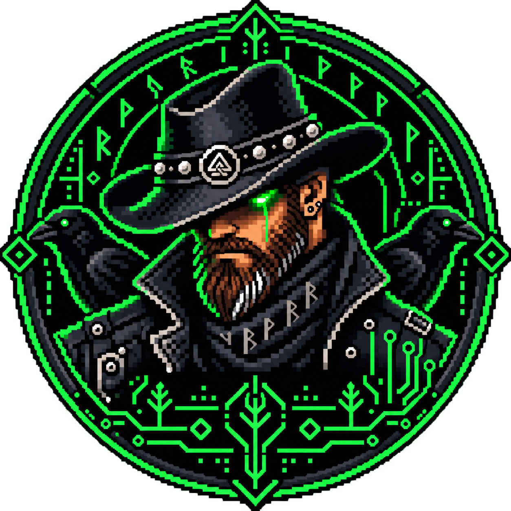

<p align="center"></p>

# butcher

A token-efficiency skill for coding assistants. It cuts repetition, narration and oversized tool output, and never cuts correctness. (SKILL.md)

## The Rundown

Butcher is one `SKILL.md` and nothing else. It tells an assistant to maximise useful engineering work per token: stop restating the prompt, stop reading the same file twice, stop narrating obvious actions, stop pasting code that was already written to disk. The prime directive is `useful engineering work / total tokens`, not "shortest answer". (SKILL.md)

- **What it protects:** correctness, requirements, security, tests, maintainability, compatibility and requested documentation. Required code is work product, not waste. (SKILL.md, Prime Directive)
- **What it cuts:** prompt restatement, plans, progress narration, repeated searches, full logs after success, unchanged code and redundant summaries. (SKILL.md, Output Butchering)
- **Output shape:** `Done: <material result>. Tests: <result>.` on success; `Blocked: <cause>. Evidence: <error>. Need: <resolution>.` on failure; findings only, ordered by severity, for reviews. (SKILL.md)
- **Priority when rules conflict:** correctness, then safety, explicit requirements, verification, maintainability, token efficiency, conversational style. (SKILL.md)
- **Target:** at least 50% median total-token reduction against a baseline with no measurable quality loss. This is a benchmark goal, not permission to drop information. (SKILL.md, Efficiency Target)
- **Replaces** caveman-style token skills; do not stack them.
- **Start here:** `SKILL.md`.

## Last Updated

- Last Updated: 2026-10-01
- Last Commit Date: 2026-10-01 (git evidence, before this README commit)

## Table of Contents

- [The Rundown](#the-rundown)
- [Last Updated](#last-updated)
- [Repository Overview](#repository-overview)
- [Components](#components)
- [Architecture Overview](#architecture-overview)
- [Tech Stack and Dependencies](#tech-stack-and-dependencies)
- [Project Layout](#project-layout)
- [Getting Started (Local Development)](#getting-started-local-development)
- [Configuration](#configuration)
- [Running the System](#running-the-system)
- [Deployment and CI/CD](#deployment-and-cicd)
- [Deep Code Reference](#deep-code-reference)
- [Data and Integrations](#data-and-integrations)
- [Security Notes](#security-notes)
- [Observability and Monitoring](#observability-and-monitoring)
- [Common Tasks and Troubleshooting](#common-tasks-and-troubleshooting)
- [Change Log](#change-log)
- [Contributing and Coding Standards](#contributing-and-coding-standards)
- [License](#license)

## Repository Overview

A single-file skill: `SKILL.md` with YAML front matter (`name: butcher`, version `1.0.0`) and rules in prose. No code, scripts, tests or manifests.

## Components

| Component | Type | Language/Framework | Runtime/Target | Path | Purpose |
| --- | --- | --- | --- | --- | --- |
| Butcher | Agent skill | Markdown | Any assistant that loads skills | `SKILL.md` | Token-efficiency rules |

## Architecture Overview


The frame is internal and never printed. (SKILL.md, Operating Loop)

## Tech Stack and Dependencies

None. Markdown only.

## Project Layout

```
  - SKILL.md     the skill
  - README.md    this file
  - logo.png     README logo
```

## Getting Started (Local Development)

Insufficient Evidence of an installer in this folder. Copy the `butcher` folder into the skills directory of the assistant you use, for example `~/.claude/skills/butcher` or `~/.agents/skills/butcher`.

## Configuration

None.

## Running the System

It is always on once installed. There is no command to run. Assistants load it from the skills directory.

## Deployment and CI/CD

Insufficient Evidence of CI/CD. Searched this folder and the repo root for workflows and pipeline files; none exist.

## Deep Code Reference

### Cross-Reference Index

| Rule area | Section in `SKILL.md` |
| --- | --- |
| Goal and protected work | Prime Directive, Engineering Standard |
| Prompt and context compression | Input Butchering, Context Butchering |
| Tool output | Tool Butchering |
| Edits and code delivery | Code Delivery |
| Verification | Verification, Quality Gate |
| Output format | Output Butchering |
| Conflict order | Priority Order |

## Data and Integrations

None.

## Security Notes

The skill only changes how an assistant writes and reads. It lists security, validation and authorization as protected work that must never be cut for token savings. (SKILL.md, Protected work)

## Observability and Monitoring

None built in. The benchmark section lists the metrics to track when measuring savings: input, cached input, output and reasoning tokens, task success, tests, regressions and security failures.

## Common Tasks and Troubleshooting

| Problem | Fix |
| --- | --- |
| Replies still chatty | Confirm the skill is installed where the assistant looks, then restart the session |
| Output too terse for an explanation | Ask for the explanation or report explicitly; requested prose is work product |
| Another token skill is installed | Remove it; butcher replaces caveman-style skills |

## Change Log

No history is recorded in this folder beyond version `1.0.0` in the front matter.

### Added

- `SKILL.md` 1.0.0.
- This README.

## Contributing and Coding Standards

Edit `SKILL.md` directly. Keep rules unambiguous and keep the protected-work list intact. Reinstall to every assistant's skills folder after a change so copies do not drift.

## License

Insufficient Evidence. No LICENSE file was found in this folder or at the repository root.
